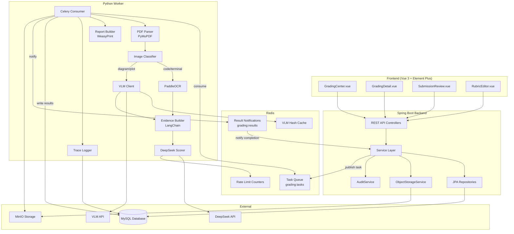

# Design Document: AI Grading Module

## Overview

The AI Grading Module adds batch grading capabilities to the teacher assistant platform. The architecture follows a two-service pattern: Spring Boot handles business logic, CRUD, and API endpoints, while a Python Worker (FastAPI + Celery) handles the AI inference pipeline. Communication between the two services uses Redis as a message queue, and both services share a MySQL database.

The pipeline flow for each submission is:
1. PDF Parsing (PyMuPDF) → text + images with metadata
2. Image Classification → code_screenshot / terminal_log / diagram / plot / other
3. OCR (PaddleOCR) → text extraction from code/terminal images
4. VLM → structured JSON descriptions for diagram/plot images (with hash caching)
5. Evidence Compression → BM25 selection of 3-8 evidence blocks per rubric dimension
6. LLM Scoring (DeepSeek) → structured JSON scores per dimension
7. Report Generation (WeasyPrint) → HTML → PDF reports

## Architecture



### Communication Pattern

1. **Task Dispatch**: Spring Boot publishes a JSON message to Redis list `grading:tasks` containing `{taskId, submissionId, pdfObjectKey, rubricId}`.
2. **Worker Consumption**: Celery workers consume from the Redis queue, process the submission, and write results directly to MySQL.
3. **Result Notification**: After processing, the worker publishes a notification to Redis channel `grading:results` with `{submissionId, status, totalScore}`.
4. **Spring Boot Listener**: A Redis subscriber in Spring Boot listens on `grading:results` and updates the Grading_Task counters (completed_count, failed_count).

## Components and Interfaces

### Spring Boot Components

#### GradingTaskController
- `POST /api/grading/tasks` — Create batch grading task (multipart: PDFs + rubricId + experimentId)
- `GET /api/grading/tasks` — List teacher's tasks (paginated, filterable by status)
- `GET /api/grading/tasks/{id}` — Task detail with submission list
- `POST /api/grading/tasks/{id}/retry` — Retry failed submissions

#### GradingSubmissionController
- `GET /api/grading/submissions/{id}` — Submission detail with scores and evidence
- `PUT /api/grading/submissions/{id}/scores` — Teacher override scores/comments
- `GET /api/grading/submissions/{id}/report` — Download individual PDF report

#### GradingExportController
- `POST /api/grading/tasks/{id}/export` — Trigger batch ZIP export
- `GET /api/grading/exports/{id}` — Download generated export file

#### RubricController
- `GET /api/grading/rubrics` — List rubrics (filterable by subject)
- `POST /api/grading/rubrics` — Create rubric
- `PUT /api/grading/rubrics/{id}` — Update rubric
- `GET /api/grading/rubrics/{id}` — Get rubric detail

#### GradingTaskService
- `createTask(teacherId, experimentId, rubricId, pdfFiles)` — Validates inputs, stores PDFs in MinIO, creates DB records, publishes to Redis queue.
- `retryFailed(taskId)` — Re-queues failed submissions.
- `onSubmissionComplete(submissionId, status, totalScore)` — Called by Redis listener to update task counters.

#### GradingSubmissionService
- `getDetail(submissionId)` — Returns submission with scores and evidence.
- `overrideScore(submissionId, dimensionId, newScore, newComment, reason, teacherId)` — Creates override record, updates score, recalculates total.

#### RubricService
- `create(rubric)` — Validates dimension weights sum to 100, persists.
- `update(rubricId, rubric)` — Checks no active tasks reference it, validates, persists.
- `listByTeacher(teacherId, subject)` — Returns filtered list.

#### RedisGradingListener
- Subscribes to `grading:results` channel.
- Parses notification and delegates to `GradingTaskService.onSubmissionComplete()`.

### Python Worker Components

#### CeleryApp (celery_app.py)
- Celery application configured with Redis broker.
- Task: `process_submission(task_message)` — Main entry point.

#### PdfParser (pipeline/pdf_parser.py)
- Input: PDF bytes from MinIO
- Output: `ParsedDocument { pages: [{ page_num, text, images: [{ bbox, image_bytes }] }] }`

#### ImageClassifier (pipeline/image_classifier.py)
- Input: image bytes, aspect ratio
- Output: classification label (code_screenshot | terminal_log | diagram | plot | other)
- Method: Rule-based (aspect ratio + color histogram analysis)

#### OcrProcessor (pipeline/ocr_processor.py)
- Input: image bytes
- Output: `OcrResult { text, confidence, lines: [{ text, bbox, confidence }] }`
- Post-processing: fullwidth→halfwidth conversion, common character fixes, indentation preservation

#### VlmClient (pipeline/vlm_client.py)
- Input: image bytes
- Output: structured JSON description
- Caching: SHA256 hash → Redis cache lookup before API call

#### EvidenceBuilder (pipeline/evidence_builder.py)
- Input: all extracted content (text, OCR results, VLM descriptions) + rubric dimensions
- Output: `Dict[dimension_id, EvidencePack]` where each pack has 3-8 Evidence_Blocks
- Uses LangChain Document schema, custom CodeLineSplitter, BM25Retriever for selection

#### DeepSeekScorer (pipeline/scorer.py)
- Input: EvidencePack + RubricDimension description
- Output: `ScoreResult { dimension_id, score, max_score, comment, evidence_ids, status }`
- Retry: Up to 3 retries on schema violation
- Rate limiting: Token bucket via Redis

#### ReportBuilder (pipeline/report_builder.py)
- Input: Submission scores + evidence + rubric
- Output: PDF bytes (HTML → PDF via WeasyPrint)

#### TraceLogger (pipeline/trace_logger.py)
- Records each pipeline step to grading_trace table with timing, model info, token counts.

### API Request/Response Schemas

#### POST /api/grading/tasks
```
Request (multipart/form-data):
  files: MultipartFile[] (1-200 PDFs)
  rubricId: Long
  experimentId: Long
  classId: Long (optional, for student matching)

Response:
{
  "data": {
    "taskId": 1,
    "status": "PENDING",
    "totalCount": 50,
    "rubricId": 1,
    "createdAt": "2025-01-01T00:00:00Z"
  }
}
```

#### GET /api/grading/tasks
```
Query: ?page=0&size=20&status=PROCESSING

Response:
{
  "data": {
    "content": [
      {
        "taskId": 1,
        "status": "PROCESSING",
        "totalCount": 50,
        "completedCount": 30,
        "failedCount": 2,
        "rubricName": "实验报告评分标准",
        "createdAt": "2025-01-01T00:00:00Z"
      }
    ],
    "totalElements": 5,
    "totalPages": 1
  }
}
```

#### GET /api/grading/submissions/{id}
```
Response:
{
  "data": {
    "submissionId": 1,
    "taskId": 1,
    "studentName": "...",
    "status": "SCORED",
    "totalScore": 85.5,
    "scores": [
      {
        "dimensionId": 1,
        "dimensionName": "代码正确性",
        "score": 18,
        "maxScore": 20,
        "weight": 40,
        "comment": "代码逻辑正确，变量命名规范...",
        "status": "SCORED",
        "evidenceIds": ["ev-001", "ev-003"],
        "override": null
      }
    ],
    "evidenceBlocks": [
      {
        "evidenceId": "ev-001",
        "kind": "ocr",
        "page": 3,
        "content": "def main():\n    ...",
        "confidence": 0.95,
        "imageUrl": "/api/grading/evidence/ev-001/image"
      }
    ]
  }
}
```

#### PUT /api/grading/submissions/{id}/scores
```
Request:
{
  "dimensionId": 1,
  "newScore": 20,
  "newComment": "代码完全正确，额外加分",
  "reason": "AI未识别到额外的测试用例"
}

Response:
{
  "data": {
    "submissionId": 1,
    "totalScore": 87.5,
    "overrideId": 1
  }
}
```

#### POST /api/grading/rubrics
```
Request:
{
  "name": "Python实验报告评分标准",
  "subject": "Python程序设计",
  "description": "适用于Python编程实验报告的评分标准",
  "dimensions": [
    {
      "name": "代码正确性",
      "description": "代码能否正确运行并产生预期输出",
      "maxScore": 20,
      "weight": 40
    },
    {
      "name": "实验分析",
      "description": "对实验结果的分析是否深入合理",
      "maxScore": 15,
      "weight": 30
    },
    {
      "name": "报告规范",
      "description": "报告格式、图表、引用是否规范",
      "maxScore": 15,
      "weight": 30
    }
  ]
}
```

## Data Models

### Database Schema

```sql
-- Flyway migration: V2__grading_init.sql

CREATE TABLE grading_rubric (
  id BIGINT NOT NULL AUTO_INCREMENT,
  teacher_id BIGINT NOT NULL,
  name VARCHAR(256) NOT NULL,
  subject VARCHAR(128),
  description TEXT,
  created_at TIMESTAMP(3) NOT NULL DEFAULT CURRENT_TIMESTAMP(3),
  updated_at TIMESTAMP(3) NOT NULL DEFAULT CURRENT_TIMESTAMP(3),
  PRIMARY KEY (id),
  CONSTRAINT fk_grading_rubric_teacher FOREIGN KEY (teacher_id) REFERENCES tap_user(id)
) ENGINE=InnoDB;

CREATE TABLE rubric_dimension (
  id BIGINT NOT NULL AUTO_INCREMENT,
  rubric_id BIGINT NOT NULL,
  name VARCHAR(256) NOT NULL,
  description TEXT,
  max_score DECIMAL(5,1) NOT NULL,
  weight INT NOT NULL,
  sort_order INT NOT NULL DEFAULT 0,
  PRIMARY KEY (id),
  CONSTRAINT fk_rubric_dimension_rubric FOREIGN KEY (rubric_id) REFERENCES grading_rubric(id) ON DELETE CASCADE
) ENGINE=InnoDB;

CREATE TABLE grading_task (
  id BIGINT NOT NULL AUTO_INCREMENT,
  teacher_id BIGINT NOT NULL,
  experiment_id BIGINT,
  class_id BIGINT,
  rubric_id BIGINT NOT NULL,
  status VARCHAR(16) NOT NULL DEFAULT 'PENDING',
  total_count INT NOT NULL DEFAULT 0,
  completed_count INT NOT NULL DEFAULT 0,
  failed_count INT NOT NULL DEFAULT 0,
  created_at TIMESTAMP(3) NOT NULL DEFAULT CURRENT_TIMESTAMP(3),
  updated_at TIMESTAMP(3) NOT NULL DEFAULT CURRENT_TIMESTAMP(3),
  PRIMARY KEY (id),
  CONSTRAINT fk_grading_task_teacher FOREIGN KEY (teacher_id) REFERENCES tap_user(id),
  CONSTRAINT fk_grading_task_rubric FOREIGN KEY (rubric_id) REFERENCES grading_rubric(id),
  CONSTRAINT chk_grading_task_status CHECK (status IN ('PENDING','PROCESSING','COMPLETED','FAILED'))
) ENGINE=InnoDB;

CREATE INDEX idx_grading_task_teacher ON grading_task(teacher_id);
CREATE INDEX idx_grading_task_status ON grading_task(status);

CREATE TABLE grading_submission (
  id BIGINT NOT NULL AUTO_INCREMENT,
  task_id BIGINT NOT NULL,
  student_id BIGINT,
  student_name VARCHAR(128),
  pdf_object_key TEXT NOT NULL,
  original_filename VARCHAR(512),
  status VARCHAR(24) NOT NULL DEFAULT 'PENDING',
  total_score DECIMAL(6,2),
  error_message TEXT,
  created_at TIMESTAMP(3) NOT NULL DEFAULT CURRENT_TIMESTAMP(3),
  updated_at TIMESTAMP(3) NOT NULL DEFAULT CURRENT_TIMESTAMP(3),
  PRIMARY KEY (id),
  CONSTRAINT fk_grading_submission_task FOREIGN KEY (task_id) REFERENCES grading_task(id) ON DELETE CASCADE,
  CONSTRAINT chk_grading_submission_status CHECK (status IN ('PENDING','PROCESSING','SCORED','FAILED','NEED_MORE_EVIDENCE'))
) ENGINE=InnoDB;

CREATE INDEX idx_grading_submission_task ON grading_submission(task_id);

CREATE TABLE evidence_block (
  id BIGINT NOT NULL AUTO_INCREMENT,
  submission_id BIGINT NOT NULL,
  evidence_id VARCHAR(64) NOT NULL,
  kind VARCHAR(16) NOT NULL,
  page INT,
  bbox_json JSON,
  content TEXT,
  confidence DECIMAL(4,3),
  image_key TEXT,
  metadata_json JSON,
  created_at TIMESTAMP(3) NOT NULL DEFAULT CURRENT_TIMESTAMP(3),
  PRIMARY KEY (id),
  CONSTRAINT fk_evidence_block_submission FOREIGN KEY (submission_id) REFERENCES grading_submission(id) ON DELETE CASCADE,
  CONSTRAINT chk_evidence_block_kind CHECK (kind IN ('text','ocr','vlm','vlm_failed'))
) ENGINE=InnoDB;

CREATE UNIQUE INDEX uq_evidence_block_evidence_id ON evidence_block(evidence_id);
CREATE INDEX idx_evidence_block_submission ON evidence_block(submission_id);

CREATE TABLE score_item (
  id BIGINT NOT NULL AUTO_INCREMENT,
  submission_id BIGINT NOT NULL,
  dimension_id BIGINT NOT NULL,
  score DECIMAL(5,1),
  max_score DECIMAL(5,1) NOT NULL,
  weight INT NOT NULL,
  comment TEXT,
  evidence_ids_json JSON,
  status VARCHAR(24) NOT NULL DEFAULT 'PENDING',
  created_at TIMESTAMP(3) NOT NULL DEFAULT CURRENT_TIMESTAMP(3),
  updated_at TIMESTAMP(3) NOT NULL DEFAULT CURRENT_TIMESTAMP(3),
  PRIMARY KEY (id),
  CONSTRAINT fk_score_item_submission FOREIGN KEY (submission_id) REFERENCES grading_submission(id) ON DELETE CASCADE,
  CONSTRAINT fk_score_item_dimension FOREIGN KEY (dimension_id) REFERENCES rubric_dimension(id),
  CONSTRAINT chk_score_item_status CHECK (status IN ('PENDING','SCORED','NEED_MORE_EVIDENCE'))
) ENGINE=InnoDB;

CREATE INDEX idx_score_item_submission ON score_item(submission_id);

CREATE TABLE score_override (
  id BIGINT NOT NULL AUTO_INCREMENT,
  score_item_id BIGINT NOT NULL,
  teacher_id BIGINT NOT NULL,
  old_score DECIMAL(5,1),
  new_score DECIMAL(5,1) NOT NULL,
  old_comment TEXT,
  new_comment TEXT,
  reason TEXT,
  created_at TIMESTAMP(3) NOT NULL DEFAULT CURRENT_TIMESTAMP(3),
  PRIMARY KEY (id),
  CONSTRAINT fk_score_override_score_item FOREIGN KEY (score_item_id) REFERENCES score_item(id) ON DELETE CASCADE,
  CONSTRAINT fk_score_override_teacher FOREIGN KEY (teacher_id) REFERENCES tap_user(id)
) ENGINE=InnoDB;

CREATE TABLE grading_trace (
  id BIGINT NOT NULL AUTO_INCREMENT,
  submission_id BIGINT NOT NULL,
  step VARCHAR(64) NOT NULL,
  status VARCHAR(16) NOT NULL,
  duration_ms BIGINT,
  model_used VARCHAR(64),
  input_tokens INT,
  output_tokens INT,
  error_message TEXT,
  metadata_json JSON,
  created_at TIMESTAMP(3) NOT NULL DEFAULT CURRENT_TIMESTAMP(3),
  PRIMARY KEY (id),
  CONSTRAINT fk_grading_trace_submission FOREIGN KEY (submission_id) REFERENCES grading_submission(id) ON DELETE CASCADE
) ENGINE=InnoDB;

CREATE INDEX idx_grading_trace_submission ON grading_trace(submission_id);

CREATE TABLE report_file (
  id BIGINT NOT NULL AUTO_INCREMENT,
  task_id BIGINT NOT NULL,
  submission_id BIGINT,
  file_type VARCHAR(8) NOT NULL,
  object_key TEXT NOT NULL,
  created_at TIMESTAMP(3) NOT NULL DEFAULT CURRENT_TIMESTAMP(3),
  PRIMARY KEY (id),
  CONSTRAINT fk_report_file_task FOREIGN KEY (task_id) REFERENCES grading_task(id) ON DELETE CASCADE,
  CONSTRAINT fk_report_file_submission FOREIGN KEY (submission_id) REFERENCES grading_submission(id) ON DELETE SET NULL,
  CONSTRAINT chk_report_file_type CHECK (file_type IN ('pdf','zip'))
) ENGINE=InnoDB;
```

### JPA Entity Mapping

Entities follow the existing project pattern (see `DocumentEntity`):
- Package: `com.tap.backend.domain.grading`
- Use `@Entity`, `@Table`, `@Id`, `@GeneratedValue(IDENTITY)`
- Use `@ManyToOne(fetch = LAZY)` for relationships
- Use `@PrePersist` for `createdAt` defaults
- Use `@Column` with explicit names matching the SQL schema
- JSON columns stored as `String` with Jackson serialization in the service layer

Key entities: `GradingRubricEntity`, `RubricDimensionEntity`, `GradingTaskEntity`, `GradingSubmissionEntity`, `EvidenceBlockEntity`, `ScoreItemEntity`, `ScoreOverrideEntity`, `GradingTraceEntity`, `ReportFileEntity`.


## Correctness Properties

*A property is a characteristic or behavior that should hold true across all valid executions of a system — essentially, a formal statement about what the system should do. Properties serve as the bridge between human-readable specifications and machine-verifiable correctness guarantees.*

### Property 1: Task creation produces correct submissions

*For any* valid batch of N PDF files (1 ≤ N ≤ 200) with a valid rubric ID, creating a Grading_Task should produce exactly N Submission records, each with a non-null pdf_object_key, and the task's total_count should equal N and rubric_id should match the input.

**Validates: Requirements 1.1, 1.2, 1.6**

### Property 2: Invalid file filtering preserves valid submissions

*For any* batch containing a mix of valid PDF files and invalid (non-PDF) files, the system should create Submissions only for valid PDFs, and the count of created Submissions should equal the count of valid PDFs in the input.

**Validates: Requirements 1.4**

### Property 3: Task counter invariant

*For any* Grading_Task, at all times: `completed_count + failed_count + (number of PENDING/PROCESSING submissions) == total_count`. The sum of completed and failed counts never exceeds total_count.

**Validates: Requirements 2.3, 2.4**

### Property 4: Retry targets only failed submissions

*For any* Grading_Task with mixed submission statuses, calling retry should re-queue exactly the submissions with status FAILED, reset them to PENDING, and leave all other submissions unchanged.

**Validates: Requirements 2.5**

### Property 5: Rubric validation — weights and dimensions

*For any* set of Rubric_Dimensions, the system should accept the rubric if and only if: the sum of all weights equals 100, every dimension has a non-empty name, every max_score is greater than zero, and every weight is greater than zero.

**Validates: Requirements 3.2, 3.5**

### Property 6: Rubric immutability during active tasks

*For any* Rubric referenced by a Grading_Task with status PROCESSING, update attempts should be rejected. For rubrics not referenced by any PROCESSING task, updates should succeed.

**Validates: Requirements 3.3**

### Property 7: Rubric subject filtering

*For any* teacher with rubrics across multiple subjects, filtering by a specific subject should return exactly the rubrics matching that subject, and no others.

**Validates: Requirements 3.4**

### Property 8: Image classifier output domain

*For any* image input, the Image_Classifier should return exactly one label from the set {code_screenshot, terminal_log, diagram, plot, other}.

**Validates: Requirements 4.3**

### Property 9: Pipeline routing correctness

*For any* classified image, if the label is code_screenshot or terminal_log then OCR processing should be invoked; if the label is diagram or plot then VLM processing should be invoked; if the label is other then neither OCR nor VLM should be invoked.

**Validates: Requirements 5.1, 6.1**

### Property 10: OCR fullwidth-to-halfwidth conversion

*For any* string containing fullwidth ASCII characters (U+FF01–U+FF5E), the post-processor should convert each fullwidth character to its halfwidth equivalent (U+0021–U+007E), and the output should contain no fullwidth ASCII characters.

**Validates: Requirements 5.2**

### Property 11: VLM hash determinism

*For any* image, computing the perceptual hash twice on the same image bytes should produce the same hash value. Different image bytes should (with high probability) produce different hashes.

**Validates: Requirements 6.2**

### Property 12: Evidence pack size bounds

*For any* submission with at least 3 evidence blocks per dimension, each Evidence_Pack should contain between 3 and 8 Evidence_Blocks, and each block should have non-null evidence_id, kind, page, and content fields.

**Validates: Requirements 7.1, 7.3**

### Property 13: BM25 selection optimality

*For any* set of evidence blocks and a rubric dimension description, the blocks selected by BM25 retrieval should all have BM25 scores greater than or equal to any non-selected block's score for that dimension.

**Validates: Requirements 7.2**

### Property 14: DeepSeek scorer output schema conformance

*For any* valid scorer response, the parsed output should contain: dimension_id matching the input, score between 0 and max_score, a non-empty comment, and a non-empty list of evidence_id references; OR status should be "NEED_MORE_EVIDENCE".

**Validates: Requirements 8.1**

### Property 15: Weighted total score calculation

*For any* submission with all dimensions scored, the total_score should equal the sum of `(score / max_score) * weight` across all dimensions. This must hold both after initial AI scoring and after any teacher override.

**Validates: Requirements 8.5, 9.3**

### Property 16: Score override audit trail

*For any* score override operation, the Score_Override record should contain the exact old_score and old_comment values that existed on the Score_Item before the override, and the Score_Item should be updated to the new values.

**Validates: Requirements 9.2, 9.4**

### Property 17: Submission detail completeness

*For any* scored submission with N rubric dimensions, the detail response should contain exactly N Score_Items, and each Score_Item should reference at least one Evidence_Block that exists in the submission's evidence list.

**Validates: Requirements 9.1**

### Property 18: Batch export file count

*For any* Grading_Task with N completed submissions, the batch export ZIP should contain exactly N PDF report files.

**Validates: Requirements 10.2**

### Property 19: Trace record integrity

*For any* pipeline execution of a submission, every executed step should produce a Grading_Trace record with non-null submission_id, step name, status, and duration_ms. For LLM/VLM API calls, model_used, input_tokens, and output_tokens should also be non-null.

**Validates: Requirements 11.1, 11.2, 11.4**

### Property 20: Schema violation retry limit

*For any* DeepSeek scorer invocation that receives malformed JSON responses, the system should retry at most 3 times before marking the dimension as failed.

**Validates: Requirements 8.3**

### Property 21: Rate limiter enforcement

*For any* burst of N API requests where N exceeds the configured rate limit, the actual number of API calls made within any rate limit window should not exceed the configured limit.

**Validates: Requirements 12.2, 12.3**

### Property 22: Rubric round-trip persistence

*For any* valid Rubric with dimensions, creating the rubric and then retrieving it should produce an equivalent object with the same name, subject, description, and dimension list (including names, max_scores, and weights).

**Validates: Requirements 3.1**

## Error Handling

### Spring Boot Error Handling

| Error Scenario | HTTP Status | Response |
|---|---|---|
| Invalid PDF file in batch | 200 (partial success) | Task created with rejected files listed in response |
| Batch size > 200 | 400 | `{"message": "Batch size exceeds maximum of 200"}` |
| Rubric not found | 404 | `{"message": "Rubric not found"}` |
| Rubric weights != 100 | 400 | `{"message": "Dimension weights must sum to 100"}` |
| Rubric in use (update) | 409 | `{"message": "Rubric is referenced by active grading tasks"}` |
| Submission not found | 404 | `{"message": "Submission not found"}` |
| Score override invalid | 400 | `{"message": "Score must be between 0 and max_score"}` |
| Unauthorized access | 403 | `{"message": "Access denied"}` |

### Python Worker Error Handling

| Error Scenario | Behavior |
|---|---|
| PDF parse failure | Mark submission FAILED with "PDF_PARSE_ERROR", log trace |
| OCR failure on single image | Log trace, skip image, continue pipeline |
| VLM API failure | Log trace, create vlm_failed evidence block, continue |
| VLM API timeout | Retry once, then create vlm_failed block |
| DeepSeek schema violation | Retry up to 3 times, then mark dimension as NEED_MORE_EVIDENCE |
| DeepSeek API failure | Retry up to 3 times with exponential backoff, then mark submission FAILED |
| Rate limit exceeded | Queue request, wait for window reset, retry |
| Celery task transient error | Retry up to 3 times with exponential backoff |
| MySQL connection failure | Celery retry with backoff |
| MinIO read failure | Mark submission FAILED with "STORAGE_ERROR" |

### Retry Strategy

```
Celery task retry: max_retries=3, backoff=True, backoff_max=300
DeepSeek schema retry: max_retries=3, no backoff (immediate retry)
VLM API retry: max_retries=1, timeout=30s
Rate limit retry: wait until window reset (sliding window)
```

## Testing Strategy

### Property-Based Testing

Library: **Hypothesis** (Python) for the Python Worker pipeline, **jqwik** (Java) for Spring Boot service layer.

Each correctness property from the design document will be implemented as a property-based test with minimum 100 iterations. Tests will be tagged with the format:

```
# Feature: ai-grading, Property {N}: {property_text}
```

**Python Worker property tests** (using Hypothesis):
- Property 8: Image classifier output domain
- Property 9: Pipeline routing correctness
- Property 10: OCR fullwidth-to-halfwidth conversion
- Property 11: VLM hash determinism
- Property 12: Evidence pack size bounds
- Property 13: BM25 selection optimality
- Property 14: DeepSeek scorer output schema conformance
- Property 15: Weighted total score calculation (Python side)
- Property 19: Trace record integrity
- Property 20: Schema violation retry limit
- Property 21: Rate limiter enforcement

**Spring Boot property tests** (using jqwik):
- Property 1: Task creation produces correct submissions
- Property 2: Invalid file filtering preserves valid submissions
- Property 3: Task counter invariant
- Property 4: Retry targets only failed submissions
- Property 5: Rubric validation — weights and dimensions
- Property 6: Rubric immutability during active tasks
- Property 7: Rubric subject filtering
- Property 15: Weighted total score calculation (Java side)
- Property 16: Score override audit trail
- Property 17: Submission detail completeness
- Property 18: Batch export file count
- Property 22: Rubric round-trip persistence

### Unit Testing

Unit tests complement property tests for specific examples and edge cases:

**Spring Boot unit tests**:
- Controller endpoint tests with MockMvc
- Service layer tests with mocked repositories
- Edge cases: empty batch, max batch size (200), rubric with single dimension
- Error conditions: non-existent task/submission/rubric IDs

**Python Worker unit tests**:
- PDF parser with synthetic test PDFs
- OCR post-processor with known fullwidth strings
- Image classifier with sample images of each type
- Evidence builder with known document sets
- Report builder HTML output verification
- Edge cases: empty PDF, PDF with no images, all images same type

### Integration Testing

- Spring Boot ↔ Redis queue publish/consume
- Python Worker ↔ MySQL result writing
- Python Worker ↔ MinIO file read
- End-to-end: upload PDF → process → verify scores in DB
- Redis listener: verify task counter updates on submission completion
